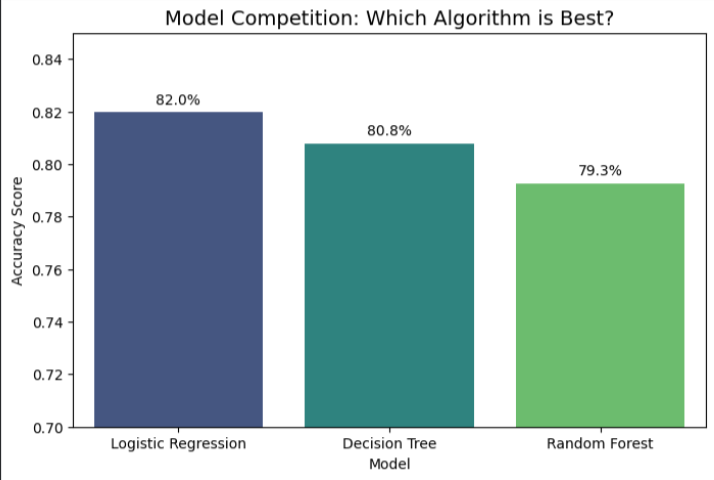
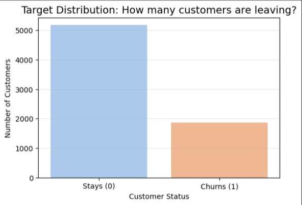
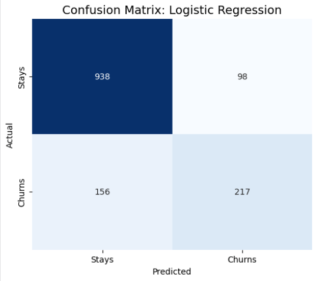
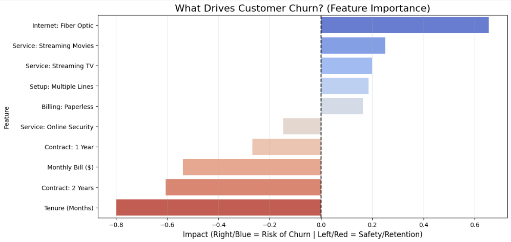

# 📉 Telco Customer Churn Prediction (Capstone Project)



## 1. Project Objective
This capstone project applies the **CRISP-DM** (Cross-Industry Standard Process for Data Mining) lifecycle to solve a critical business problem: **Customer Churn**. 

Working as a data science team, we developed a machine learning pipeline to analyze customer demographics, services, and billing information to predict which customers are at risk of leaving the company.

## 2. Research Question
*What are the primary indicators of customer churn, and can we accurately predict which customers are at risk of leaving to take proactive retention measures?*

## 3. Dataset
* **Source:** [Telco Customer Churn (Kaggle)](https://www.kaggle.com/blastchar/telco-customer-churn)
* **Description:** The dataset contains 7,043 customer records with 21 features, including tenure, monthly charges, contract type, and payment methods.
* **File:** The raw data file `WA_Fn-UseC_-Telco-Customer-Churn.csv` is included in this repository.

## 4. Methodology (CRISP-DM)

### Phase 1 & 2: Business Understanding & Data Prep
We defined churn as a binary classification problem. Data preparation involved:
* Handling missing values in `TotalCharges`.
* Encoding categorical variables (One-Hot Encoding).
* Scaling numerical features to normalize tenure and spending.
* Splitting data into 80% Training and 20% Testing sets.

### Phase 3: Exploratory Data Analysis (EDA)
We visualized the target balance to understand the baseline churn rate. As shown below, the dataset is imbalanced, with more customers staying than leaving.



### Phase 4: Modeling
We trained and tuned three distinct machine learning algorithms:
1.  **Logistic Regression** (Baseline model for interpretability).
2.  **Decision Tree** (To capture non-linear decision rules).
3.  **Random Forest** (Ensemble method for robustness).

### Phase 5: Evaluation
We compared models based on **Accuracy**, **Precision**, and **Recall**. 

* **The Winner:** **Logistic Regression** achieved the highest accuracy (**81.97%**), outperforming the more complex Random Forest model. This indicates the relationships in this specific dataset are largely linear.



The Confusion Matrix above shows our final model's performance on the test set. It successfully identified **217** high-risk churners (True Positives).

### Phase 6: Deployment
We developed a **"Churn Risk Calculator"** tool (included in the notebook). This script allows business managers to input new customer details (e.g., *Tenure: 2 months, Contract: Month-to-month*) and receive an instant Churn Probability score with actionable recommendations.

## 5. Key Findings & Insights
Our analysis identified the most significant drivers of churn using feature importance scores:



* 🔴 **High Risk Factors:**
    * **Fiber Optic Internet:** The strongest predictor of churn. Customers with this service are highly dissatisfied.
    * **Electronic Check Payment:** Associated with higher churn rates.
* 🟢 **Retention Drivers:**
    * **Tenure:** New customers are the most vulnerable. Risk drops significantly as tenure increases.
    * **2-Year Contracts:** Long-term commitments are the single best way to reduce churn.

## 6. How to Run This Project
1.  **Clone the repository:**
    ```bash
    git clone [https://github.com/YourUsername/Your-Repo-Name.git](https://github.com/YourUsername/Your-Repo-Name.git)
    ```
2.  **Install dependencies:**
    ```bash
    pip install -r requirements.txt
    ```
3.  **Run the Notebook:**
    Open `Capstone_Project.ipynb` in Jupyter Notebook or Google Colab and run all cells to reproduce the analysis and models.

## 7. Project Structure
* `Capstone_Project.ipynb`: The main source code containing all CRISP-DM phases.
* `WA_Fn-UseC_-Telco-Customer-Churn.csv`: The dataset used for training.
* `requirements.txt`: List of Python libraries required.
* `images/`: Folder containing visualization assets.

